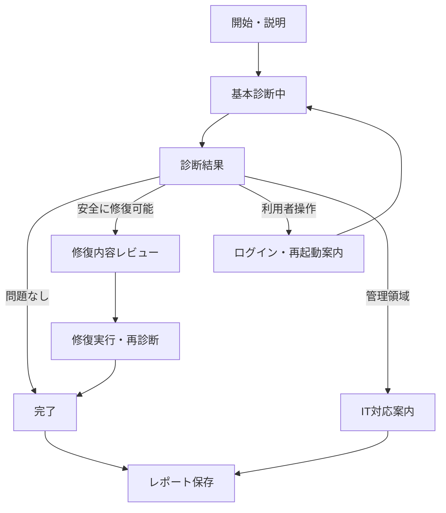

# 03. UI / UX Specification

## 3.1 画面設計の前提

本アプリは開発ツールではなく診断ユーティリティです。チャット、コードエディタ、常設ターミナル、プロジェクト管理は含めません。

UIはWindowsのトラブルシューティングに近い直線的なフローとし、利用者が専門用語を理解しなくても「現状」「影響」「次の行動」を把握できるようにします。

## 3.2 モックとの差分

`assets/setup-doctor-mockup.png` はレイアウト参考です。実装では以下を修正します。

- 「Node.js」を「シェル」に変更する。
- Gitを必須の緑／赤判定ではなく「推奨」として扱う。
- 「PATH」はClaude本体PATHとGit Bash設定を分ける。
- 一括「自動修正する」の前に、変更内容のレビュー画面を入れる。
- 「権限」は一般的な管理者権限チェックではなく、各修復に必要な権限として表示する。
- DesktopアプリとCLIの競合状態を独立項目にする。

## 3.3 ナビゲーションフロー

## 3.4 画面一覧

### Screen S-01: 開始

**目的:** 診断範囲と非公式性を伝え、基本診断を開始する。

表示要素:

- アプリ名
- 「このツールはAnthropic公式製品ではありません」
- 診断対象の簡潔な説明
- ネットワークを使わない基本診断であること
- 主ボタン「診断を開始」
- 副ボタン「診断項目を見る」
- バージョン、プライバシー、About

推奨文言:

> Claude Codeを利用できる環境か確認します。基本診断では、OS、シェル、Claude Code、PATH、認証、Gitの状態を確認します。設定の変更は、内容を確認して承認した場合だけ実行します。

### Screen S-02: 診断中

**目的:** 処理状況を示し、ハングと誤認させない。

表示要素:

- 全体進捗
- 現在の診断項目
- 完了項目
- 「キャンセル」
- 「詳細ログを表示」折りたたみ

状態文言例:

- Windowsの要件を確認しています
- 利用可能なシェルを探しています
- Claude Codeの実行ファイルを確認しています
- ログイン状態を確認しています

### Screen S-03: 診断結果

**目的:** 結果を重要度順に表示する。

上部に全体状態カードを表示する。

| 全体状態 | 見出し | 補足 |
|---|---|---|
| Ready | Claude Codeを利用できます | 必須項目に問題はありません |
| ReadyWithRecommendations | 利用できます | 推奨設定を確認してください |
| Repairable | 修復可能な問題があります | 変更内容を確認して修復できます |
| UserActionRequired | 追加操作が必要です | ログインまたはターミナル再起動が必要です |
| ITActionRequired | 管理者への確認が必要です | 企業ポリシーまたはネットワーク制限の可能性があります |
| Unsupported | この環境は対象外です | 対応OS・64-bit・メモリ要件を確認してください |
| Unknown | 状態を確認できませんでした | 詳細ログを確認してください |

診断項目の表示順:

1. Windows要件
2. シェル
3. Claude Code本体
4. Claude Code PATH
5. 認証
6. Git／Git Bash（推奨）
7. ネットワーク（実行時のみ）
8. 詳細診断

各行の構成:

- アイコン
- 項目名
- 必須／推奨／任意／IT管理
- 状態語
- 1行の要約
- 「詳細」
- 修復可能な場合は具体的なアクション名

例:

> **Claude Code PATH - 修復可能**  
> Claude Codeはインストールされていますが、ターミナルから見つけられません。  
> アクション: `%USERPROFILE%\.local\bin` をユーザーPATHへ追加

### Screen S-04: 修復内容レビュー

**目的:** 一括修復の不透明性を避ける。

表示要素:

- 選択可能な修復項目
- 変更対象
- 変更前
- 変更後
- 管理者権限の要否
- 新しいターミナルが必要か
- バックアップ先
- チェックボックス「内容を確認しました」
- 主ボタン「選択した修復を実行」
- 副ボタン「戻る」

例:

| 項目 | 変更内容 | 権限 | 再起動 |
|---|---|---|---|
| Claude Code PATH | User PATHに `%USERPROFILE%\.local\bin` を追加 | 不要 | ターミナル再起動 |
| Git Bash設定 | `~/.claude/settings.json` のenvへパスを追加 | 不要 | Claude Code再起動 |

### Screen S-05: 修復実行中

表示要素:

- アクション単位の進捗
- バックアップ完了
- 変更実行
- 再診断
- 赤actedログ
- キャンセル可否

キャンセル時の扱い:

- 進行中の原子的ファイル書き込みは安全な境界まで完了させる。
- 完了済みアクションは戻さない。
- 残りは未実行と表示する。
- 「元に戻す」対応アクションがある場合のみ別ボタンで提供する。

### Screen S-06: 完了

成功文言:

> セットアップを確認しました。Claude Codeを利用できる状態です。

部分成功:

> 修復は完了しました。新しいターミナルを開いて、もう一度確認してください。

IT対応:

> この問題は端末の管理ポリシーまたはネットワーク制限に関連している可能性があります。診断結果を保存し、情報システム担当者へ共有してください。

操作:

- 「Claude Codeを起動」
- 「新しいPowerShellを開く」
- 「もう一度診断」
- 「診断結果を保存」
- 「結果をコピー」

## 3.5 状態表現

| Status | 日本語 | 用途 |
|---|---|---|
| Pass | 問題なし | 要件を満たす |
| Warning | 確認推奨 | 利用可能だが改善余地あり |
| Fail | 問題あり | 必須要件を満たさない |
| Repairable | 修復可能 | アプリの安全な修復対象 |
| UserAction | 操作が必要 | ログイン、再起動など |
| ITAction | 管理者確認 | ポリシー、EDR、ネットワーク |
| NotApplicable | 対象外 | 選択構成では不要 |
| Unknown | 確認不能 | タイムアウト、予期しない出力 |

色だけに依存せず、必ずアイコンと状態語を併用します。

## 3.6 エラーメッセージ構造

すべてのエラーは次の順で表示します。

1. **何が起きたか**
2. **利用への影響**
3. **安全にできる対応**
4. **自動修復できない理由**
5. **詳細コード**

例:

> **Claude Codeを起動できませんでした**  
> `claude.exe` は見つかりましたが、5秒以内にバージョン情報を返しませんでした。古いClaude Desktopの実行エイリアスが優先されている可能性があります。Claude Desktopを更新してから再診断してください。  
> 詳細コード: `CHK-CLAUDE-003/TIMEOUT_WINDOWS_APPS`

## 3.7 アクセシビリティ

- すべてのボタンにAutomationNameを設定する。
- 結果一覧は読み上げ順を固定する。
- 状態変更時はライブリージョンで通知する。
- 詳細ログは等幅フォントを使うが、本文は可読性の高いUIフォントを使う。
- 125%、150%、200%スケールでレイアウトを確認する。
- 最小ウィンドウサイズを定義し、主要ボタンを隠さない。
