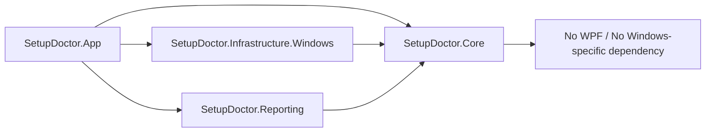
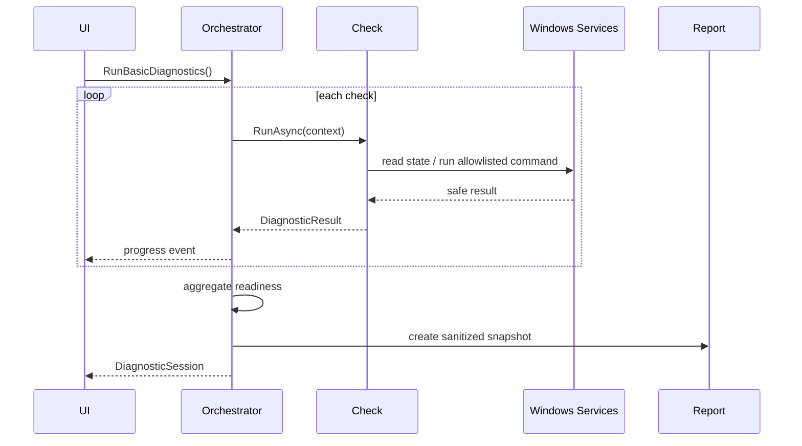

# 04. Technical Architecture

## 4.1 採用技術

| 項目 | 採用 | 理由 |
|---|---|---|
| Runtime | .NET 10 LTS | 2026-07時点のActive LTS。長期保守と自己完結配布が可能 |
| UI | WPF | Windows専用、成熟、企業端末での互換性、MVVMとの相性 |
| Language | C# | Windows API、非同期処理、テスト基盤が整っている |
| Pattern | MVVM + Use Case orchestration | UIと診断／修復ロジックを分離 |
| Distribution | Self-contained single-file | 利用者端末へ.NET Runtime導入を要求しない |
| Test | xUnitまたはMSTest | Coreの単体テストとWindows統合テストを分離 |

Native AOTはWPF互換性と保守コストを考慮し、MVPでは使用しません。単一ファイル自己完結配布を採用します。

## 4.2 ソリューション構造

```text
ClaudeCodeSetupDoctor.sln
src/
  SetupDoctor.App/
    App.xaml
    Views/
    ViewModels/
    Services/Navigation/
    Resources/
  SetupDoctor.Core/
    Diagnostics/
    Remediation/
    Models/
    Policies/
  SetupDoctor.Infrastructure.Windows/
    Processes/
    Environment/
    FileSystem/
    Network/
    WindowsApi/
  SetupDoctor.Reporting/
    Json/
    Text/
tests/
  SetupDoctor.Core.Tests/
  SetupDoctor.Infrastructure.Windows.Tests/
  SetupDoctor.IntegrationTests/
```

## 4.3 依存方向



`Core` はWPF、レジストリ、Process、ファイルシステムへ直接依存しません。

## 4.4 ドメインモデル

### DiagnosticCheckDefinition

```csharp
public sealed record DiagnosticCheckDefinition(
    string Id,
    string DisplayName,
    RequirementLevel Requirement,
    TimeSpan Timeout,
    bool UsesNetwork,
    IReadOnlyList<string> RemediationIds);
```

### DiagnosticResult

```csharp
public sealed record DiagnosticResult(
    string CheckId,
    DiagnosticStatus Status,
    string SummaryKey,
    string DetailCode,
    IReadOnlyDictionary<string, string> SafeMetadata,
    TimeSpan Duration,
    DateTimeOffset CompletedAtUtc);
```

### RemediationPlanItem

```csharp
public sealed record RemediationPlanItem(
    string RemediationId,
    string Title,
    string Target,
    string BeforeSummary,
    string AfterSummary,
    bool RequiresElevation,
    bool RequiresNewProcess,
    bool SupportsRollback);
```

### Enums

- `RequirementLevel`: Required, Recommended, Optional, ITManaged
- `DiagnosticStatus`: Pass, Warning, Fail, Repairable, UserAction, ITAction, NotApplicable, Unknown
- `OverallReadiness`: Ready, ReadyWithRecommendations, Repairable, UserActionRequired, ITActionRequired, Unsupported, Unknown

## 4.5 主要インターフェース

```csharp
public interface IDiagnosticCheck
{
    string Id { get; }
    Task<DiagnosticResult> RunAsync(DiagnosticContext context, CancellationToken cancellationToken);
}

public interface ICommandRunner
{
    Task<CommandResult> RunAsync(CommandRequest request, CancellationToken cancellationToken);
}

public interface IRemediationAction
{
    string Id { get; }
    Task<RemediationPreview> PreviewAsync(RemediationContext context, CancellationToken cancellationToken);
    Task<RemediationExecutionResult> ExecuteAsync(RemediationContext context, CancellationToken cancellationToken);
    Task<RollbackResult> RollbackAsync(RemediationContext context, CancellationToken cancellationToken);
}
```

## 4.6 診断オーケストレーション



チェックは次のグループで順次または並列実行します。

1. System: OS、アーキテクチャ、メモリ
2. Shell: PowerShell、pwsh、Git Bash
3. Claude discovery: PATH、既定パス、候補一覧
4. Claude execution: version、auth
5. Optional: Git、WinGet、network、doctor

同一実行ファイルへ複数コマンドを同時に投げず、認証やアップデートと競合しないようにします。

## 4.7 外部コマンド実行

### 必須要件

- `UseShellExecute = false` を基本とする。
- `ArgumentList` を使い、文字列連結でシェルコマンドを作らない。
- stdout、stderrを非同期取得する。
- WorkingDirectoryは明示する。
- 環境変数は必要最小限だけ引き継ぐ。
- タイムアウト時は起動したプロセスツリーだけ終了する。
- 実行パスを検証し、想定外の相対パスを拒否する。

### 可視ターミナルが必要な操作

`claude auth login` のように利用者操作を必要とする処理は、Windows TerminalまたはPowerShellを可視状態で起動します。アプリは認証コードやトークンを受け取りません。

## 4.8 実行ファイル探索

探索順は判定用であり、勝手にPATHの優先順位を変更しません。

1. `where.exe claude` の全結果
2. 現プロセスPATHを独自に走査
3. `%USERPROFILE%\.local\bin\claude.exe`
4. WinGet package metadata（取得可能な場合）
5. npm／legacy位置（警告用、MVPでは修復しない）

各候補について次を保持します。

- 正規化済みフルパス
- PATH順位
- ファイル存在
- Authenticode署名の概要（任意、秘密情報なし）
- FileVersionInfo
- `--version` 実行結果
- WindowsApps配下か

## 4.9 User PATH管理

永続User PATHと現プロセスPATHを分けて扱います。

- Read: `Environment.GetEnvironmentVariable("PATH", EnvironmentVariableTarget.User)`
- Write: 同APIのUser target
- 区切り: `;`
- 比較: 大文字小文字を区別せず、末尾区切りと引用符を正規化
- 追加対象: `%USERPROFILE%\.local\bin` を展開した絶対パス
- 表示: `%USERPROFILE%\.local\bin` に再マスク
- 変更後: `WM_SETTINGCHANGE` を送信し、新規プロセスへ通知
- 既存ターミナルには反映されないため再起動を案内

## 4.10 Claude settings JSON管理

対象はユーザー設定 `~/.claude/settings.json` のみです。

処理手順:

1. ファイルがなければ空オブジェクトとして扱う。
2. UTF-8で読み込む。
3. JSON構文を検証する。
4. 不正JSONの場合は自動修復せず、バックアップとエラー案内を行う。
5. 既存の全キーを保持する。
6. `env.CLAUDE_CODE_GIT_BASH_PATH` だけを追加／更新する。
7. 同一ディレクトリにタイムスタンプ付きバックアップを作る。
8. 一時ファイルへ書き、flush後に置換する。
9. 再読み込みして値を確認する。
10. Claude Code再起動後に再診断する。

Managed settingsやProject settingsは変更しません。

## 4.11 インストール形態の判定

判定は最善努力とし、Unknownを許容します。

- Native: `%USERPROFILE%\.local\bin\claude.exe`
- WinGet: `winget list --id Anthropic.ClaudeCode -e`
- npm global: `npm -g ls @anthropic-ai/claude-code`（npmが存在する場合だけ、警告用）
- Desktop alias: WindowsAppsの `Claude.exe`
- VS Code private copy: PATHへ通常出ないため、MVPでは対象外

複数存在する場合、削除は提案せず、候補一覧と推奨インストールを表示します。

## 4.12 レポート

レポートは `specs/diagnostic-result.schema.json` に従います。

保存形式:

- `setup-doctor-report-YYYYMMDD-HHMMSS.json`
- `setup-doctor-report-YYYYMMDD-HHMMSS.txt`

除外／マスク:

- ユーザー名
- メールアドレス
- APIキー、トークン、Cookie
- 完全なホームパス
- 環境変数値
- OAuth出力

## 4.13 配布

MVP publish例:

```powershell
dotnet publish src/SetupDoctor.App/SetupDoctor.App.csproj `
  -c Release `
  -r win-x64 `
  --self-contained true `
  -p:PublishSingleFile=true
```

単一ファイルはOSとアーキテクチャ別に作成します。正式配布ではコード署名、バージョン情報、ライセンス、SBOM、SHA-256を追加します。
