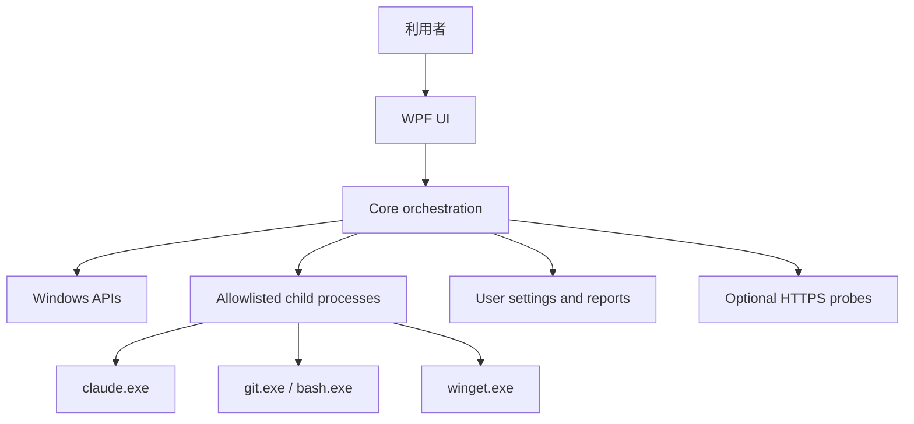

# 07. Security, Privacy, and Enterprise Constraints

## 7.1 脅威モデル

本アプリはPATH、外部実行ファイル、JSON設定、ネットワークを扱うため、次のリスクがあります。

- PATHハイジャックにより偽の `claude.exe`、`git.exe`、`bash.exe` を実行する。
- 引数連結によるコマンドインジェクション。
- 設定ファイル破損。
- PATH全体やユーザー情報のログ漏えい。
- 認証出力からトークンやメールアドレスを保存する。
- 管理者権限を過剰要求する。
- EDR／GPO制限を回避しようとして企業ポリシーに違反する。
- 未署名配布物がSmartScreenやEDRで警告される。
- 外部サイトから取得したインストーラーを検証せず実行する。

## 7.2 信頼境界

外部実行ファイル、PATH、設定ファイル、ネットワーク応答はすべて信頼できない入力として扱います。

## 7.3 実行ファイル検証

- 相対パスを実行しない。
- 探索後にフルパスへ固定する。
- 実行直前にファイル存在を再確認する。
- 可能であればWindows Authenticode署名を取得し、表示用メタデータへ追加する。
- 署名結果だけで安全と断定しない。
- WindowsApps候補はCLI候補として慎重に扱う。
- ネットワーク共有上の実行ファイルはMVPで自動修復対象外とする。

## 7.4 コマンドインジェクション対策

- `ProcessStartInfo.ArgumentList` を使用する。
- `cmd.exe /c` と文字列連結を避ける。
- ユーザーが任意パスを入力できる場合、ファイル選択ダイアログで実在する `bash.exe` に限定する。
- 改行、引用符、制御文字を含む入力を拒否する。
- コマンドテンプレートを設定ファイルから無制限に読み込まない。
- Allowlist外の実行ファイルは起動しない。

## 7.5 権限

- アプリ本体はstandard userで起動する。
- 自動昇格マニフェストを付けない。
- HKLM、Machine PATH、Program Files配下の管理設定は変更しない。
- User PATH、ユーザーClaude設定、ユーザーレポートだけを変更対象とする。
- 管理者権限が必要な状況はITActionとして表示する。

## 7.6 認証情報

- `claude auth status` のraw JSONを永続化しない。
- exit codeと「認証済み／未認証／確認不能」だけを保存する。
- メールアドレス、組織ID、アカウントIDはレポートから除外する。
- `ANTHROPIC_API_KEY` 等は存在有無だけ確認し、値を取得・表示・送信しない。
- OAuthログインは外部ターミナル／ブラウザに委ねる。

## 7.7 ログとレポート

### ローカルログ

- 保存先: `%LOCALAPPDATA%\SetupDoctor\Logs`
- 既定保持: 最大10ファイルまたは30日を設計目標とする
- Debugビルド以外ではraw stdoutを保存しない
- 例外stack traceはローカルのみ、エクスポート時に選択制

### マスク規則

- `%USERPROFILE%` 配下は `%USERPROFILE%\...` に置換
- メール形式は `[REDACTED_EMAIL]`
- token/key/secretを含むJSONキーの値は `[REDACTED]`
- 長いBearer風文字列、JWT形式は `[REDACTED_TOKEN]`
- PATH全体は保存せず、対象エントリの存在有無だけ記録

## 7.8 ネットワーク

- 基本診断はネットワークなしで実行可能にする。
- ネットワーク診断は利用者が明示的に開始する。
- HTTPS証明書検証を無効にしない。
- プロキシや独自CAを自動設定しない。
- 403、TLS、DNS、timeoutを別分類するが、原因を断定しない。
- 送信データは到達性確認に必要な最小リクエストだけとする。

## 7.9 企業端末

次の管理領域は読み取り表示までとし、変更しません。

- `HKLM\SOFTWARE\Policies\ClaudeCode`
- `HKCU\SOFTWARE\Policies\ClaudeCode`
- `C:\Program Files\ClaudeCode\managed-settings.json`
- Group Policy
- AppLocker
- Software Restriction Policies
- EDR allowlist
- Windows certificate stores
- System proxy／PAC

検出できない場合は「確認できない」と表示し、推測で「EDRが原因」と断定しません。

## 7.10 サプライチェーン

- 依存NuGetパッケージを最小化する。
- 依存バージョンを固定し、ロックファイルを使用する。
- リリース時にSBOMを生成する。
- 配布物へSHA-256を添付する。
- 正式配布ではコード署名証明書を使用する。
- Claude Code本体のバイナリを本アプリへ同梱しない。
- インストールは公式WinGet package IDを使用する。

## 7.11 商標・表示

- アプリ名とAboutに「非公式」を明示する。
- Anthropicのロゴを許可なく使用しない。
- 「Claude Codeを修復する公式ツール」と誤認させない。
- READMEと配布画面に、Anthropicとの提携・承認を示さない旨を記載する。

## 7.12 セキュリティ受入条件

- 任意コマンド入力欄が存在しない。
- 単体テストで実際のUser PATHやsettings.jsonを変更しない。
- すべての修復にプレビューと確認がある。
- レポートのシークレットスキャンテストが通る。
- 不正JSON時に上書きしない。
- Access denied時に昇格や回避を自動実行しない。
